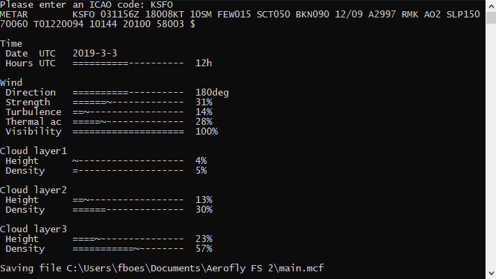

 Aerofly Weather 2 (AeroflyWX)
=========================================================

Copy METAR weather information into [IPCAS' Aerofly FS 2](https://www.aerofly.com/).

AeroflyWX will copy the following METAR weather information to your configuration file while Aerofly FS 2 is _not_ running:

* Time and day (will set the year and month to current year and month because they are not present in METAR information)
* Wind & turbulences
* Thermal activity
* Clouds (height & density)

The METAR weather information can be supplied manually, or can be fetched from an URL.

AeroflyWX is capable of setting weather values which you cannot access in Aerofly FS 2. This is tested and is done deliberately.

Requirements
------------

* Microsoft Windows 10 has to be installed.
* IPACS Aerofly FS 2 has to be installed.
* A `main.mcf` has to be located at `%USERPROFILE%\Documents\Aerofly FS2\main.mcf`. If this is not the case point the tool to the file location by setting the `--file <FILE>` parameter.
* An internet connection to the [AVWX REST API](http://avwx.rest/) is required. If you have no internet connection, supply a METAR string via `--metar "<METAR>"`. If there is an internet connection but AVWX is not reachable, start the tool with the `--url <URL>` parameter set to a different METAR REST API.

Installation
------------

1. Download the current release ZIP from https://github.com/fboes/aerofly-weather-cpp/releases.
2. Unpack the ZIP file to some sensible location.
3. Create a shortcut on your desktop by right-clicking `AeroflyWX.exe` > "Send to" > "Desktop (Create shortcut)".
3. Start the application by clicking on the desktop link.

In case you want to use this application on a different operation system, consider [building your own executable from this project](CONTRIBUTING.md).

Usage
-----

You will need a copy of IPACS' Aerofly FS 2 which has run at least once. This creates a file called `main.mcf`, which contains all settings and the weather data in Aerofly FS 2. This file will be modified by the app.

Before starting the app be sure that Aerofly FS 2 is _not_ running. On start-up the app will load the current settings from your `main.mcf`.

By starting the app METAR data will be fetched from a remote internet service for the given ICAO code. If it is successful, it will paste the METAR code and convert it into the corresponding Aerofly FS 2 values. It also allows for changing values which are not accessible from inside Aerofly FS 2.

Optionally you can enter a METAR code manually. Call the app with `--help` appended to see all options available.

**Important:** Be sure to quit the app before starting Aerofly FS 2 to no accidentally change values while AFS2 is running and to free up memory. Also you may want to backup your `main.mcf` in case something goes wrong.

HTTP services
-------------

This tool is compatible with the following METAR services:

* [AVWX](http://avwx.rest/): This is the default HTTP service.
* [CheckWX](https://www.checkwx.com/): You will need to get an API key to use this service.

You may also try any other HTTP service which offers METAR information as raw text or JSON. See the [configuration guide on how to set different METAR services](docs/configuration.md).

Update
------

Just repeat all steps for a regular installation.

Status
-------

Legal stuff
-----------

Author: [Frank Boës](http://3960.org)

Copyright & license: See [LICENSE.txt](LICENSE.txt) and [Curl's license](https://curl.haxx.se/docs/copyright.html)

This tool is NOT affiliated with, endorsed, or sponsored by IPACS GbR. As stated in the [LICENSE.txt](LICENSE.txt), this tool comes with no warranty and might damage your files.

This software complies with the General Data Protection Regulation (GDPR) as it does not collect nor transmits any personal data but for data your submit by using the CLI commands using URLs. For GDPR compliance of these services refer to the legal statements of these services.
