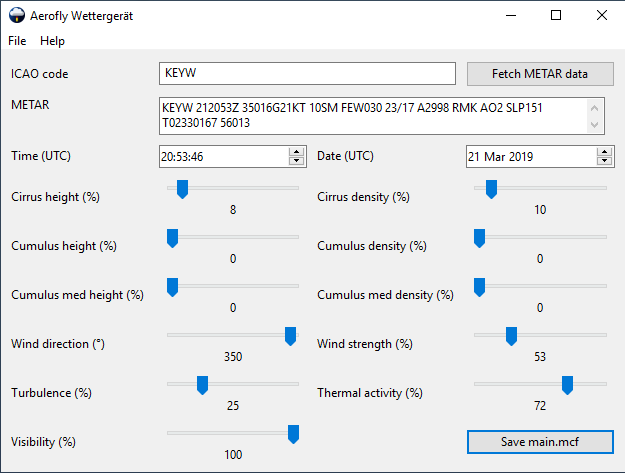

#  Aerofly Wettergerät

The missing settings and convenience functions for [IPCAS' Aerofly FS 2 and Aerofly FS 4](https://www.aerofly.com/).

The <i>Aerofly Wettergerät</i> can do the following for your local Aerofly FS 2/4 installation while it is _not_ running:

-   Set weather values from METAR codes
-   Fetch live or historical weather from internet data sources
-   Change time and date, as well as show you the local [Nautical time](https://en.wikipedia.org/wiki/Nautical_time) for your aircraft
-   Set cloud layers in feet AGL instead of percent
-   Make third cloud level accessible
-   Set wind strength in knots instead of percent, allowing for higher wind speeds
-   Set visibility in meters

## Requirements

-   Microsoft Windows 7 / 8 / 10 / 11 (64 bit) has to be installed. See below for other operating systems.
-   IPACS Aerofly FS 2/4 has to be installed.
-   An internet connection to the [Aviation Weather Center REST API](https://aviationweather.gov/) is required. If there is an internet connection but the Aviation Weather Center is not reachable, start the tool with the `--url <URL>` parameter set to a different METAR REST API.

In case you want to use this application on a different operation system, consider [building your own executable from this project](CONTRIBUTING.md).

## Installation

1. Download the latest release ZIP from https://github.com/fboes/aerofly-wettergeraet/releases/latest.
2. Unpack the ZIP file to some sensible location, e.g. `C:\Program Files\aerofly-wettergeraet-x64\`.
3. Create a shortcut on your desktop by right-clicking `aerofly-wettergeraet-desktop.exe` > "Send to" > "Desktop (Create shortcut)".  
   You might want to re-label the shortcut to "Aerofly Wettergerät".
4. Start the desktop application by clicking on the desktop link.

You may need to do some [additional configuration if your `main.mcf` is not found automatically](docs/configuration.md).

## Usage

You will need a copy of IPACS' Aerofly FS 2/4 which has run at least once. This creates a file called `main.mcf`, which contains all settings and the weather data in Aerofly FS 2/4. This file will be modified by the application.

1. On start-up the application will load the current settings from your `main.mcf`. You can also reload the file from the "File" menu.
2. By using the "Fetch" button, METAR information will be fetched from the internet. If it is successful, it will paste the METAR code and convert it into the corresponding Aerofly FS 2/4 values. Optionally you can enter a METAR code manually.
3. It also allows for changing values which are not accessible from inside Aerofly FS 2/4.
4. Hitting the "Save" button copies the data to your `main.mcf`.

**Important:** Be sure to quit the application before starting Aerofly FS 2/4 to not accidentally change values while AFS2 is running and to free up memory. Also you may want to backup your `main.mcf` in case something goes wrong.

For troubleshooting look into the [Frequently Asked Questions](docs/faq.md).

## Update

Just repeat all steps for a regular installation.

## Status

> The <i>Aerofly Wettergerät</i> is the successor to ["Aerofly Weather" (AeroWX)](https://github.com/fboes/aerofly-weather/).

## Legal stuff

Author: [Frank Boës](https://3960.org)

Copyright & license: See [LICENSE.txt](LICENSE.txt)  
and [Curl's license](docs/LICENSE-curl.txt), also found at https://curl.haxx.se/docs/copyright.html  
and [WxWidgets's license](docs/LICENSE-wxwidgets.txt), also found at https://www.wxwidgets.org/about/licence/  
and [Aerofly Sample DLL's license](docs/LICENSE-aerofly.txt), also found at https://www.aerofly.com/community/filebase/index.php?file/2-sdk-tools/.

This tool is NOT affiliated with, endorsed, or sponsored by IPACS GbR. As stated in the [LICENSE.txt](LICENSE.txt), this tool comes with no warranty and might damage your files.

This software complies with the General Data Protection Regulation (GDPR) as it does not collect nor transmits any personal data but for data your submit by using the CLI commands using URLs. For GDPR compliance of these services refer to the legal statements of these services.

The <i>Aerofly Wettergerät</i> (German for "weather device") is handcrafted <i>Wertarbeit</i>. 😉
