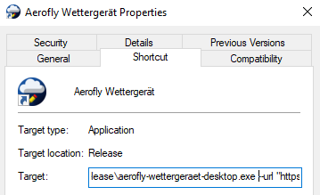

 Configuration of the <i>Aerofly Wettergerät</i>
=======================================================================

For more information about command line options, call the command line variant of this tool with `--help` appended to it. 

There is also a [source code documentation on command-line parameters](https://github.com/fboes/aerofly-wettergeraet/blob/master/src/WettergeraetLib/Argumentor.cpp#L65) applicable for the command-line as well as the desktop variant of this tool.

Supplying parameters to the desktop application
-----------------------------------------------

To supply parameters to the desktop application, you will have to modify the desktop link:

1. Right-click your desktop icon, select "Properties" and search for the "target" of your link.
1. Enclose the path in your target in quotes, e.g. converting `C:\...\aerofly-wettergeraet.desktop.exe` to `"C:\...\aerofly-wettergeraet.desktop.exe"`.
1. Append a parameter to the shortcut's target by adding a whitespace at the end of target, add the parameter name, another whitespace and the parameter value enclosed in quotes. This looks like `--PARAMETER_NAME "PARAMETER_VALUE"`, e.g. `--apikey "ABCDEF"` to supply an API key.
1. Repeat this last step for every extra parameter you want to add.



These parameters are available:

| Parameter    | Example value             | Description                                |
| ------------ | ------------------------- | ------------------------------------------ |
| `--file`     | `"C:\Users\...\main.mcf"` | Absolute file location of your `main.mcf`. |
| `--url`      | `"https://avwx.rest/api/metar/XXXX?options=&format=json&onfail=cache"` | Fetch response via HTTP from this URL. If URL contains `XXXX` this will be replaced by the ICAO airport code. |
| `--apikey`   | `"12345abcd"`             | Sent HTTP header `X-API-Key` / `Authorization` set to this value for all HTTP API calls. |
| `--response` | `"raw"`                   | How to interpret HTTP response. Set this to `raw` if the response is plain text. Set this to `json` if the response is JSON object. |
| `--hours`    | `"-8"`                    | Offset time read from METAR code by this value, given in hours. |


Change default values
---------------------

You may set the default values for `aerofly-wettergeraet.exe` / `aerofly-wettergeraet-desktop.exe` by setting environment variables. After settings these, every startup of the <i>Wettergerät</i> will use these values if not overriden by command line parameters.

These variables are available:

| Variable             | Example value           | Description                                |
| -------------------- | ----------------------- | ------------------------------------------ |
| `AEROFLYWX_FILE`     | `C:\Users\...\main.mcf` | Absolute file location of your `main.mcf`. |
| `AEROFLYWX_URL`      | `https://avwx.rest/api/metar/XXXX?options=&format=json&onfail=cache` | Fetch response via HTTP from this URL. If URL contains `XXXX` this will be replaced by the ICAO airport code. |
| `AEROFLYWX_APIKEY`   | `12345abcd`             | Sent HTTP header `X-API-Key` / `Authorization` set to this value for all HTTP API calls. |
| `AEROFLYWX_RESPONSE` | `raw`                   | How to interpret HTTP response. Set this to `raw` if the response is plain text. Set this to `json` if the response is JSON object. |
| `AEROFLYWX_HOURS`    | `-8`                    | Offset time read from METAR code by this value, given in hours. |

In Windows 10 set environment variables by following these steps:

1. Click the Windows icon on your task bar and enter "Environment". Click the app icon for "Edit the system environment variables".
2. In the "System properties" window, click the "Environment variables" button. You will see the user variables.
3. Click the "New" button to add a new variable. If the desired variable already exists, select the variable and click the "Edit" button.
4. Add the variable name (see above), and set the variable value to a value you want it to have.
5. Confirm your modification via "Ok".

In Windows 10 set environment variables from the command line by opening up a terminal and enter the following lines:

```batch
set  VARIABLE="VALUE"
setx VARIABLE %VARIABLE%
```

For Mac OSX / Linux open up a terminal and enter the following lines:

```bash
VARIABLE="VALUE"
```

Register file associations
--------------------------

You may register `.mcf` and `.rwx` file types with the desktop version of the <i>Aerofly Wettergerät</i> by double-clicking these files. This will open up the application with the corresponding file loaded.

---

Return to [table of contents](README.md).
